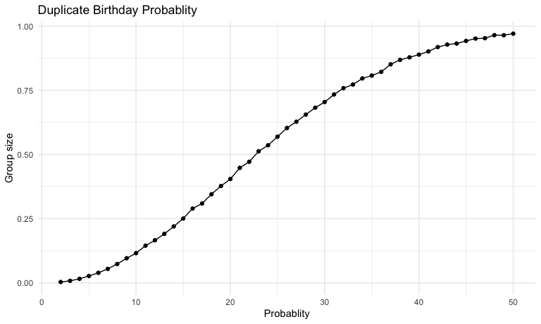
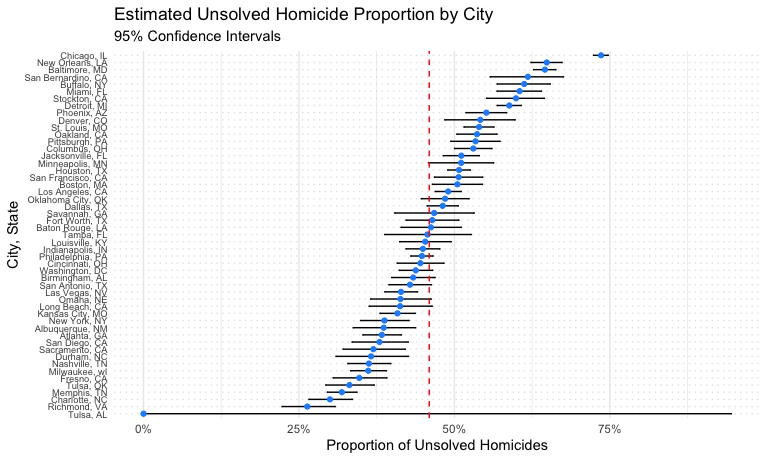

p8105_hw5_ls4236
================
Liliang Su
2025-10-30

## Problem 1

Write a function to check if there is at least two people sharing a
birthday.

``` r
# source("./source/bday_sim.R")

bday_sim = function(n_room){
  
  birthdays = sample(1:365, n_room, replace = TRUE)
  
  repeated_bday = length(unique(birthdays)) < n_room
  
  repeated_bday
}
```

Iterate the function and Store the results.

``` r
bday_sim_results =
  expand_grid(
    bdays = 2:50,
    iter = 1:10000
  ) |> 
  mutate(
    result = map_lgl(bdays, bday_sim)
  ) |> 
  group_by(bdays) |> 
  summarise(
    prob_repeat = mean(result)
  )
```

Plot the probability as a function of group size.

``` r
bday_sim_results |> 
  ggplot(aes(x = bdays, y = prob_repeat)) +
  geom_point() +
  geom_line() +
  labs(
    title = "Duplicate Birthday Probablity", 
    x = "Probablity", 
    y = "Group size"
    )
```



## Problem 2

### Simulation

Fix the sample size `n` and standard deviation `sigma` of distribution.

``` r
n = 30 # fixed sample size
sigma = 5 # true standard deviation
```

Other variables.

``` r
n_sim = 5000 # number of datasets to generate for each mu
mu_null = 0 # null hypothesis value
alpha = 0.05 # significance level
mu_values = c(1, 2, 3, 4, 5, 6) # true mean values awaiting to test
```

Write the function to conduct t-test for a single sample

``` r
t_test_sim = function(mu_true, n_subj = 30, sigma_true = 5, mu_null = 0, alpha = 0.05){
  
  # generate the data
  x = rnorm(n = n_subj, mean = mu_true, sd = sigma_true)
  
  # perform the one-sample t-test
  test_output = t.test(x, mu = mu_null, conf.level = alpha)
  
  # clean output and calculate results
  test_output_cleaned = broom::tidy(test_output) |>
    # select the point estimate (mu_hat) and p-value
    select(mu_hat = estimate, p_value = p.value) |>
    mutate(
      # determine if H0 was rejected
      rejected_H0 = (p_value < alpha)
    )
  
  test_output_cleaned
}
```

Test the function for true `mu` = 0 iteratively.

``` r
sim_results_mean0 = 
  expand_grid(
    mu_true = 0,
    iter = 1:n_sim
  ) |> 
  mutate(
    results = map(mu_true, t_test_sim)
  ) |> 
  unnest(results)

sim_results_mean0 |> 
  head(10) |> 
  knitr::kable()
```

| mu_true | iter |     mu_hat |   p_value | rejected_H0 |
|--------:|-----:|-----------:|----------:|:------------|
|       0 |    1 | -0.7469732 | 0.4550732 | FALSE       |
|       0 |    2 |  0.1115830 | 0.9151010 | FALSE       |
|       0 |    3 |  0.5705805 | 0.4880381 | FALSE       |
|       0 |    4 | -0.5295039 | 0.4903969 | FALSE       |
|       0 |    5 |  0.0027991 | 0.9966899 | FALSE       |
|       0 |    6 | -1.0431923 | 0.2424981 | FALSE       |
|       0 |    7 | -0.3025581 | 0.7408405 | FALSE       |
|       0 |    8 |  1.0444031 | 0.3303683 | FALSE       |
|       0 |    9 | -1.9372669 | 0.0355929 | TRUE        |
|       0 |   10 |  0.5687825 | 0.5085410 | FALSE       |

Create a data frame to store simulation results of all other conditions.

``` r
power_sim_results_df = 
  expand_grid(
    mu_true = mu_values,
    iter = 1:n_sim
  ) |> 
  mutate(
    results = map(mu_true, t_test_sim)
  ) |> 
  unnest(results)

power_sim_results_df |> 
  head(10) |> 
  knitr::kable()
```

| mu_true | iter |    mu_hat |   p_value | rejected_H0 |
|--------:|-----:|----------:|----------:|:------------|
|       1 |    1 | 1.2982695 | 0.1193543 | FALSE       |
|       1 |    2 | 1.0764662 | 0.3695779 | FALSE       |
|       1 |    3 | 1.2503811 | 0.0835569 | FALSE       |
|       1 |    4 | 1.3665474 | 0.1303499 | FALSE       |
|       1 |    5 | 0.4319408 | 0.6324521 | FALSE       |
|       1 |    6 | 1.5258522 | 0.0673802 | FALSE       |
|       1 |    7 | 0.9489153 | 0.3627286 | FALSE       |
|       1 |    8 | 0.5337363 | 0.5833434 | FALSE       |
|       1 |    9 | 1.8847843 | 0.0609347 | FALSE       |
|       1 |   10 | 0.0962422 | 0.9138104 | FALSE       |

### Plotting

``` r
# Calculate the power by averaging across the 5000 simulation runs
power_df = power_sim_results_df |>
  group_by(mu_true) |>
  summarise(
    power = mean(rejected_H0), 
    .groups = 'drop'
  )

# Plot 1: proportion of times the null was rejected vs. true mean values
power_plot = power_df |>
  ggplot(aes(x = mu_true, y = power)) +
  geom_line() +
  geom_point() +
  geom_hline(yintercept = 0.05, linetype = "dashed", color = "red") +
  labs(
    title = "Plot 1: Power vs. True Mean at 0.05 Significance level",
    x = "True Mean",
    y = "Power (Proportion of Rejections)",
    caption = paste0("n=", n, ", σ=", sigma, ", α=", alpha)
  ) 

power_plot
```


Association bewteen effect size and power:

- The plot clearly shows a strong positive association between the true
  effect size ($\mu_{true} - \mu_0$) and the power of the test. In other
  words, as the true mean increases from 1 to 6, the difference between
  the null value ($\mu_0 = 0$) and the true mean increases.

- The relatively larger standardized effect size
  ($\frac{\mu_{true} - \mu_0}{\sigma}$) also makes it easier for the
  $t$-test to detect the effect, thus increasing the probability of
  correctly rejecting the false null hypothesis.

``` r
# Calculate mean estimates under two different conditions
mean_estimates_df = power_sim_results_df |>
  group_by(mu_true) |>
  summarise(
    # mean estimate across all samples
    mu_hat_all = mean(mu_hat),
    # mean estimate only across samples where H0 was rejected
    mu_hat_rejected = mean(mu_hat[rejected_H0]),
    .groups = 'drop'
  ) |>
  # Reshape data for plotting
  pivot_longer(
    -mu_true, 
    names_to = "group", 
    values_to = "avg_estimate"
  ) |>
  mutate(
    group = factor(group, 
                   levels = c("mu_hat_all", "mu_hat_rejected"),
                   labels = c("Average Estimate (All Samples)", 
                              "Average Estimate (Rejected H0 only)")
    )
  )

# Plot 2: average estimate vs. true mean (two overlaid plots)
estimate_plot = mean_estimates_df |>
  ggplot(aes(x = mu_true, y = avg_estimate, color = group, group = group)) +
  geom_line(linewidth = 1) +
  geom_point(size = 3) +
  labs(
    title = "Plot 2: Average Estimate vs. True Mean",
    x = "True Mean",
    y = "Average Estimate of Mean",
    color = "Sample Group"
  )

estimate_plot
```


Discussion on Bias by the overlaid plot:

Is the average estimate of $\hat{\mu}$ across rejected tests
approximately equal to the true mean $\mu_{true}$?

- No. For estimates that Rejected H0, the average estimate is
  significantly greater than the true mean $\mu_{true}$, especially for
  smaller effect sizes ($\mu=1, 2, 3$), which is referred to as
  “selection bias”, though it gradually overlaps with average estimate
  across all samples (close to $\mu_{true}$) as the effect size
  increases.

- For estimates of ALL samples, due to the Central Limit Theorem, when
  sample size is large enough, the average estimate across all 5000
  simulated samples is, as expected, approximately equal to the true
  mean.

Why the Rejected Samples are Biased?

- When the true effect size ($\mu_{true}$) is small, the test has low
  power. Hence for the null hypothesis to be rejected under low power,
  the random sample must have produced an extremely large estimate
  ($\hat{\mu}$) that is much further from the null ($\mu=0$) than the
  true mean ($\mu_{true}$).

- As the true effect size and power increase, the bias decreases because
  in most samples, the null hypothesis are rejected anyway, and
  selection is less restrictive.

## Problem 3

### Import and describe raw data

``` r
homi_df = 
  read_csv(file = "./data/homicide-data.csv", na = c("NA",".","")) |> 
  janitor::clean_names()
```

    ## Rows: 52179 Columns: 12
    ## ── Column specification ────────────────────────────────────────────────────────
    ## Delimiter: ","
    ## chr (9): uid, victim_last, victim_first, victim_race, victim_age, victim_sex...
    ## dbl (3): reported_date, lat, lon
    ## 
    ## ℹ Use `spec()` to retrieve the full column specification for this data.
    ## ℹ Specify the column types or set `show_col_types = FALSE` to quiet this message.

This dataset contains 52179 observations and 12 variables detailing
homicides across various U.S. cities.

Here are some key variables:

- `uid` (`character`): Unquie identifier for each homicide case.

- `reported_date` (`numeric`): Variable that stores the exact time the
  homicide was reported.

- Victim Demographics:

  - `victim_last`, `victim_first` (`character`): Victim’s name.
  - `victim_race` (`character`), `victim_age` (`character`),
    `victim_sex` (`character`) : Victims’ detail information.

- Location:

  - `city` (`character`), `state` (`character`), `lat` (`numeric`),
    `lon` (`numeric`): Variables specify the location of the homicide.

- Case Status:

  - `disposition` (`character`): Variable indicates the final status of
    the case.

### Tidy up data

``` r
homi_summary_df = homi_df |> 
  # create the new city_state variable
  mutate(
    city_state = str_c(city, ", ", state)
  ) |> 
  # summarize to get total and unsolved homicides
  group_by(city_state) |> 
  summarise(
    total_homicides = n(),
    unsolved_homicides = sum(
      disposition %in% c("Closed without arrest", "Open/No arrest")
    ),
    .groups = 'drop'
  )
```

### Test on Baltimore, MD

``` r
baltimore_df = homi_summary_df |> 
  filter(city_state == "Baltimore, MD")

x = pull(baltimore_df, unsolved_homicides)
n = pull(baltimore_df, total_homicides)

# save the test output as an object and tidy up
baltimore_prop_test = prop.test(x = x, n = n)

output_cleaned = broom::tidy(baltimore_prop_test)

# pull the estimated proportion and confidence intervals
baltimore_results = output_cleaned |> 
  select(
    p_hat = estimate, 
    conf_low = conf.low, 
    conf_high = conf.high
  )

baltimore_results |> 
  knitr::kable()
```

|     p_hat |  conf_low | conf_high |
|----------:|----------:|----------:|
| 0.6455607 | 0.6275625 | 0.6631599 |

### Write proportion test function

``` r
# Function
prop_test = function(dataset) {
  
  n_success = pull(dataset, unsolved_homicides)
  n_total = pull(dataset, total_homicides)
  
  test_output = prop.test(x = n_success, n = n_total)

  test_output_cleaned = broom::tidy(test_output) |> 
  select(
    p_hat = estimate, 
    conf_low = conf.low, 
    conf_high = conf.high
    )
  
  test_output_cleaned
  
}

# Tidy Pipeline
results_all_df = homi_summary_df |> 
  group_by(city_state) |> 
  # Nest into a new list-column 'city_data'
  nest(city_data = c(total_homicides, unsolved_homicides)) |> 
  mutate(
    results = map(city_data, prop_test)
  ) |> 
  select(-city_data) |> 
  unnest(results)
```

    ## Warning: There was 1 warning in `mutate()`.
    ## ℹ In argument: `results = map(city_data, prop_test)`.
    ## ℹ In group 49: `city_state = "Tulsa, AL"`.
    ## Caused by warning in `prop.test()`:
    ## ! Chi-squared approximation may be incorrect

### Plotting

``` r
unsolved_proportions_plot = results_all_df |>
  ggplot(
    aes(y = fct_reorder(city_state, p_hat), x = p_hat, xmin = conf_low, xmax = conf_high)
         ) +
  # Add the confidence intervals as horizontal error bars
  geom_errorbarh(height = 0.2, color = "gray50") +
  # Add the point estimates
  geom_point(color = "dodgerblue4", size = 1.5) +
  # Add a vertical line at the grand mean
  geom_vline(
    xintercept = mean(pull(results_all_df, p_hat)), 
    linetype = "dashed", 
    color = "red"
  ) +
  labs(
    title = "Estimated Unsolved Homicide Proportion by City",
    subtitle = "95% Confidence Intervals",
    x = "Proportion of Unsolved Homicides",
    y = "City, State"
    ) +
  scale_x_continuous(labels = scales::percent) +
  theme(
    axis.text.y = element_text(size = 7),
    panel.grid.major.y = element_line(linetype = "dotted", color = "gray90")
  )

unsolved_proportions_plot
```


